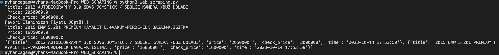

# Web Scraping ve Veritabanına Veri Ekleme Uygulaması

Bu uygulama, web scraping kullanarak veri çekme ve bir MySQL veritabanına kaydetme işlemi yapar. İşte bu uygulama hakkında detaylı bilgiler:

## İçerik

1. [Amaç](#amaç)
2. [Kurulum](#kurulum)
3. [Kullanım](#kullanım)
4. [Veritabanı Yapısı](#veritabanı-yapısı)

## Amaç

Bu uygulama, [arabam.com](https://www.arabam.com) gibi bir web sitesinden ilan bilgilerini çekerek veritabanına kaydetmeyi amaçlar. Web scraping kullanarak ilan başlıklarını ve fiyatlarını alır ve bunları bir MySQL veritabanına kaydeder. Ayrıca, kullanıcıların belirlediği fiyat eşiklerine ulaşılıp ulaşılmadığını kontrol eder.

## Kurulum

1. Python'u bilgisayarınıza yükleyin.
2. Bu depoyu bilgisayarınıza klonlayın veya ZIP dosyasını indirin.
3. Gerekli Python kütüphanelerini yüklemek için komut istemcisini kullanın:

   ```bash
   pip install pandas requests beautifulsoup4 mysql-connector-python colorama
4.MySQL veritabanı oluşturun.
5.config.json adında bir yapılandırma dosyası oluşturun ve veritabanı bağlantı bilgilerini ekleyin:

   {
    "database": {
        "host": "localhost",
        "user": "kullanici_adi",
        "password": "parola",
        "database": "veritabani_adi"
    }
}

5.urls.txt adında bir metin dosyası oluşturun ve izlemek istediğiniz ilanların URL'lerini ekleyin:

https://www.arabam.com/ilan/galeriden-satilik-land-rover-range-sport-3-0-sdv6-autobiography/2012-autobiography-3-0-sdv6-joystick-5bolge-kamera-buz-dolabi/23604878 price:2000000

https://www.arabam.com/ilan/galeriden-satilik-bmw-5-serisi-520i-premium/2015-bmw-5-20i-premium-hayalet-e-vakum-perde-elk-bagaj-k-isitma/23598960 price:1600000




Uygulama, izlenen ilanlar için fiyat kontrolünü gerçekleştirir. Fiyat eşiklerine ulaşıldığında, kullanıcıları bilgilendirir.

-products tablosu, izlenen ilanların başlıklarını, fiyatlarını, kontrol edilen fiyatları ve kontrol zamanlarını içerir.
-id sütunu, her bir ilanın benzersiz kimliğini temsil eder.
-title sütunu, ilanın başlığını içerir.
-price sütunu, ilanın anlık fiyatını tutar.
-check_price sütunu, kontrol edilen fiyatı tutar.
-date sütunu, kontrol zamanını temsil eder.
-site sütunu, verinin hangi siteden geldiğini belirtir.


